# Database Entity Relationship Diagram (ERD)
## TRUEVINE FELLOWSHIP Church App

```mermaid
erDiagram
    %% Core Entities
    users {
        UUID id PK
        TEXT email UK
        TEXT first_name
        TEXT last_name
        TEXT avatar_url
        TEXT role
        BOOLEAN is_email_verified
        TIMESTAMPTZ last_sign_in_at
        TIMESTAMPTZ created_at
        TIMESTAMPTZ updated_at
    }

    categories {
        UUID id PK
        TEXT name
        TEXT description
        TEXT color
        TEXT icon
        UUID parent_id FK
        INTEGER sort_order
        BOOLEAN is_active
        TIMESTAMPTZ created_at
        TIMESTAMPTZ updated_at
    }

    tags {
        UUID id PK
        TEXT name UK
        TEXT description
        TEXT color
        TIMESTAMPTZ created_at
        TIMESTAMPTZ updated_at
    }

    sermons {
        UUID id PK
        TEXT title
        TEXT preacher
        DATE date
        INTEGER duration
        TEXT audio_url
        TEXT thumbnail_url
        TEXT description
        UUID category_id FK
        BOOLEAN is_featured
        BOOLEAN is_published
        INTEGER downloads
        INTEGER views
        TIMESTAMPTZ created_at
        TIMESTAMPTZ updated_at
    }

    articles {
        UUID id PK
        TEXT title
        TEXT author
        TEXT content
        TEXT excerpt
        TEXT thumbnail_url
        UUID category_id FK
        BOOLEAN is_featured
        BOOLEAN is_published
        INTEGER views
        TIMESTAMPTZ published_at
        TIMESTAMPTZ created_at
        TIMESTAMPTZ updated_at
    }

    %% User Interaction Entities
    user_preferences {
        UUID user_id PK, FK
        TEXT theme
        TEXT audio_quality
        BOOLEAN auto_download
        TEXT language
        BOOLEAN notifications_new_content
        BOOLEAN notifications_reminders
        BOOLEAN notifications_updates
        BOOLEAN notifications_marketing
        TIMESTAMPTZ created_at
        TIMESTAMPTZ updated_at
    }

    user_content {
        UUID id PK
        UUID user_id FK
        TEXT content_type
        UUID content_id
        TEXT action_type
        TIMESTAMPTZ created_at
    }

    user_reminders {
        UUID id PK
        UUID user_id FK
        TEXT content_type
        UUID content_id
        TIMESTAMPTZ reminder_time
        TEXT message
        BOOLEAN is_active
        TIMESTAMPTZ created_at
        TIMESTAMPTZ updated_at
    }

    user_downloads {
        UUID id PK
        UUID user_id FK
        TEXT content_type
        UUID content_id
        TIMESTAMPTZ download_date
        INTEGER file_size
        TEXT download_path
        BOOLEAN is_offline
        TIMESTAMPTZ created_at
    }

    %% Analytics Entities
    content_views {
        UUID id PK
        UUID user_id FK
        TEXT content_type
        UUID content_id
        TIMESTAMPTZ view_date
        TEXT session_id
        INET ip_address
        TEXT user_agent
        TIMESTAMPTZ created_at
    }

    content_downloads {
        UUID id PK
        UUID user_id FK
        TEXT content_type
        UUID content_id
        TIMESTAMPTZ download_date
        INTEGER file_size
        TEXT download_method
        TIMESTAMPTZ created_at
    }

    %% Notification Entities
    push_tokens {
        UUID id PK
        UUID user_id FK
        TEXT token
        TEXT platform
        BOOLEAN is_active
        TIMESTAMPTZ created_at
        TIMESTAMPTZ updated_at
    }

    notifications {
        UUID id PK
        UUID user_id FK
        TEXT title
        TEXT body
        TEXT type
        JSONB data
        BOOLEAN is_read
        TIMESTAMPTZ sent_at
        TIMESTAMPTZ read_at
        TIMESTAMPTZ created_at
    }

    %% App Feature Entities
    app_invitations {
        UUID id PK
        UUID inviter_id FK
        TEXT invitee_email
        TEXT invitation_code UK
        TEXT status
        TIMESTAMPTZ expires_at
        TIMESTAMPTZ accepted_at
        UUID accepted_user_id FK
        TIMESTAMPTZ created_at
        TIMESTAMPTZ updated_at
    }

    %% Relationship Tables
    sermon_tags {
        UUID sermon_id FK
        UUID tag_id FK
    }

    article_tags {
        UUID article_id FK
        UUID tag_id FK
    }

    %% Relationships
    users ||--|| user_preferences : "has"
    users ||--o{ user_content : "interacts with"
    users ||--o{ user_reminders : "schedules"
    users ||--o{ user_downloads : "downloads"
    users ||--o{ content_views : "views"
    users ||--o{ content_downloads : "downloads"
    users ||--o{ push_tokens : "registers"
    users ||--o{ notifications : "receives"
    users ||--o{ app_invitations : "sends"
    users ||--o{ app_invitations : "accepts"

    categories ||--o{ categories : "parent-child"
    categories ||--o{ sermons : "categorizes"
    categories ||--o{ articles : "categorizes"

    tags ||--o{ sermon_tags : "tags"
    tags ||--o{ article_tags : "tags"

    sermons ||--o{ sermon_tags : "has"
    articles ||--o{ article_tags : "has"

    sermons ||--o{ user_content : "interacted with"
    articles ||--o{ user_content : "interacted with"

    sermons ||--o{ user_reminders : "reminded about"
    articles ||--o{ user_reminders : "reminded about"

    sermons ||--o{ user_downloads : "downloaded"
    articles ||--o{ user_downloads : "downloaded"

    sermons ||--o{ content_views : "viewed"
    articles ||--o{ content_views : "viewed"

    sermons ||--o{ content_downloads : "downloaded"
    articles ||--o{ content_downloads : "downloaded"
```



## Key Relationships Explained

### 1. User-Centric Design
- **Users** are the central entity
- All user interactions are linked to the `users` table
- User preferences, content interactions, and analytics are user-specific

### 2. Content Hierarchy
- **Categories** can have parent-child relationships (hierarchical)
- **Sermons** and **Articles** belong to categories
- **Tags** provide flexible content labeling

### 3. Many-to-Many Relationships
- **Sermons** ↔ **Tags** (via `sermon_tags`)
- **Articles** ↔ **Tags** (via `article_tags`)
- **Users** ↔ **Content** (via `user_content`)

### 4. Analytics Tracking
- **Content Views** track who viewed what and when
- **Content Downloads** track offline content usage
- Both support anonymous users (user_id can be NULL)

### 5. User Experience Features
- **User Preferences** store app settings
- **User Reminders** schedule content notifications
- **User Downloads** manage offline content
- **Push Tokens** enable notifications

### 6. App Growth Features
- **App Invitations** track referral system
- **Notifications** maintain user engagement
- **Content Analytics** help optimize content strategy

## Database Design Principles

### 1. Normalization
- Tables are normalized to reduce data redundancy
- Foreign keys maintain referential integrity
- Junction tables handle many-to-many relationships

### 2. Performance
- Indexes on frequently queried columns
- Full-text search capabilities for content
- Efficient joins through proper relationships

### 3. Security
- Row Level Security (RLS) on all tables
- User isolation through policies
- Public read access for published content only

### 4. Scalability
- UUID primary keys for distributed systems
- Timestamp tracking for audit trails
- Flexible tagging system for content organization

### 5. User Experience
- Comprehensive preference management
- Offline content support
- Personalized content recommendations
- Engagement tracking and analytics

## Query Examples

### Get User's Saved Content
```sql
SELECT 
    uc.content_type,
    uc.content_id,
    CASE 
        WHEN uc.content_type = 'sermon' THEN s.title
        WHEN uc.content_type = 'article' THEN a.title
    END as title
FROM user_content uc
LEFT JOIN sermons s ON uc.content_type = 'sermon' AND uc.content_id = s.id
LEFT JOIN articles a ON uc.content_type = 'article' AND uc.content_id = a.id
WHERE uc.user_id = $1 AND uc.action_type = 'save';
```

### Get Content with Tags
```sql
SELECT 
    s.*,
    array_agg(t.name) as tags
FROM sermons s
LEFT JOIN sermon_tags st ON s.id = st.sermon_id
LEFT JOIN tags t ON st.tag_id = t.id
WHERE s.is_published = true
GROUP BY s.id
ORDER BY s.date DESC;
```

### Search Content
```sql
SELECT * FROM search_content('faith', NULL, NULL, 20, 0);
```

This schema provides a solid foundation for the TRUEVINE FELLOWSHIP Church App with all the features specified in the PRD, including content management, user interactions, analytics, and engagement features.
